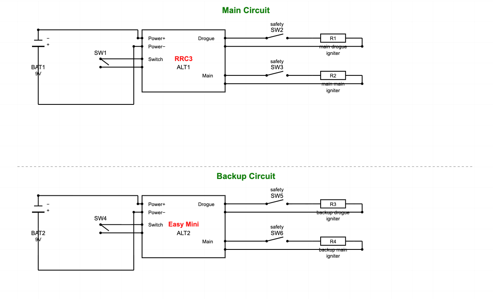
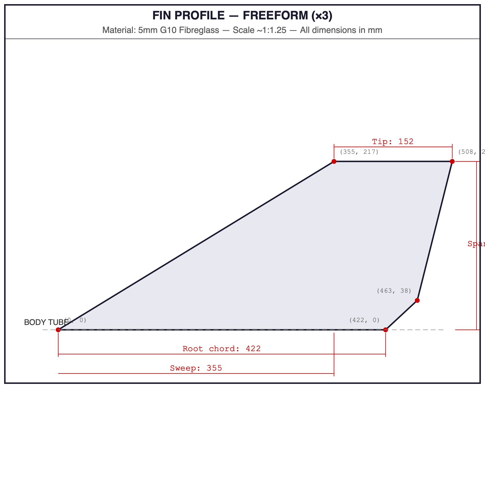
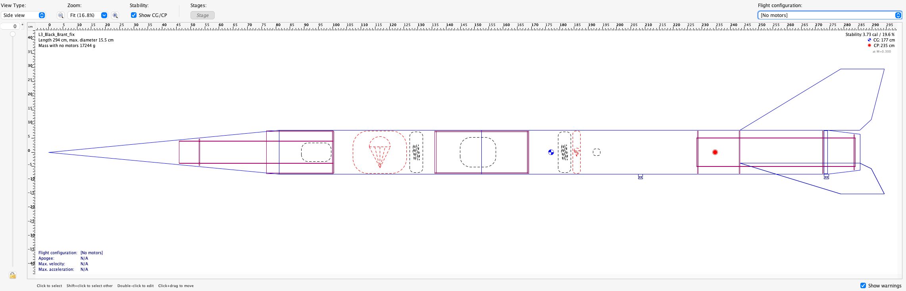
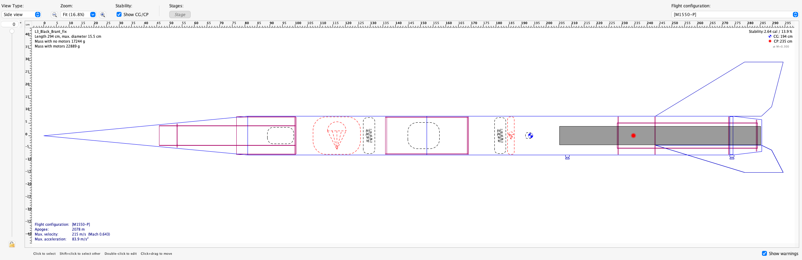

\begin{center}
\textbf{TAP Advisors:} Prof.\ Andreas Müller (L3CC), Jüerg Thüering (TAP)
\end{center}

\newpage

# Design

Project consists of a 6-inch diameter Madcow fibreglass airframe with a 98mm motor mount (using a 75mm adapter for the 75/6400 casing) intended for K–N motors. It is intended to be a sport scale version of the classic Canadian sounding rocket, the Black Brant II.

The booster design is a 3-fin model, with large swept-back G10 fins. There is a 12" payload section with a 1" switch band between the booster and the main Madcow G10 body tube. The nose cone is a 5:1 conical Madcow fibreglass nose cone, which will contain GPS tracking electronics. Recovery systems will be deployed via classic two-break dual deploy. The overall weight of the rocket without motor is approximately 17.25 kg. Pad mass including motor and propellant is approximately 22.9 kg (75/6400 case with M1550).

## Projected Altitudes

Given the current availability of Aerotech motors, several different scenarios have been simulated in OpenRocket 24.12.

| Motor Designation | Total Impulse | Casing  | Projected Altitude |
|:------------------|:--------------|:--------|-------------------:|
| M1297             | 5414.6 Ns     | 75/5120 | 2058 m             |
| M1500             | 5220 Ns       | 75/5120 | 1906 m             |
| M1550\*           | 5600 Ns       | 75/6400 | 2053 m             |

\*denotes preferred choice.

# Electronics

To ensure safe deployment of parachutes, we will use redundant dual deployment with different manufacturers of electronics to minimise risk of correlated failures.

## Primary (MissileWorks RRC3)

- Drogue deployment: Apogee.
- Main deployment: 315 m.
- Arming switch: Missileworks 2 pole rotary switch.
- Battery: Varta 9V Alkaline.
- Brownout protection: Brownout capacitor as part of device.

## Backup (Altus Metrum EasyMini)

- Drogue deployment: Apogee + 1 s.
- Main deployment: 280 m.
- Arming switch: Missileworks 2 pole rotary switch.
- Battery: Varta 9V Alkaline.
- Brownout protection: Brownout comparator as part of device (schematic: <https://altusmetrum.org/EasyTimer/v1/easytimer-sch.pdf> — same comparator for EasyMini).

## GPS and Flight Monitoring (Silicdyne Fluctus)

- No deployment capabilities.
- Ride along in nose cone to provide real-time tracking.
- Arming switch: Slide switch on bulkplate.
- Battery: Varta 9V Alkaline.

## Wiring Diagram

{width=90%}

# Recovery Devices

Redundant dual deployment of parachutes at apogee and at 315 m above ground level is intended to safely bring the rocket back to earth.

## Main Parachute

The main parachute will be contained in a 6" Fruity Chutes deployment bag, with a 24" pilot chute to pull it out of the bag. The whole setup will be protected with an 18" diameter Nomex protector.

- Type: Fruity Chutes 120" Iris Standard Parachute (IFC-120-N).
- $C_D$: 2.2
- Mass: 1020.6 g
- Descent rate: 4.32 m/s

## Drogue Parachute

The drogue parachute will be protected with an 18" diameter Nomex protector.

- Type: Fruity Chutes 36" Iris Standard Parachute.
- $C_D$: 2.2
- Mass: 141.7 g
- Descent rate: 14.4 m/s

## Parachute Deployment Flow

{width=90%}

# Attachment Points and Harnesses

There are three distinct points in flight where force is exerted on the harnesses and attachment points:

1. Airframe separation.
2. Drogue parachute opening.
3. Main parachute opening.

## 1. Airframe Separation

Airframe separation is caused by pressurisation of the body chambers by a pyrotechnic charge. This pressurisation creates a force on both components of the rocket body. This force continues to do work on the rocket parts until they separate, and the pressure can be released. The total work done by the charge on the rocket components is:

$$W = F \cdot L_{\text{coupler}}$$

We know that the components of the rocket then continue to separate at a constant speed until they reach the extent of the shock cord holding them together. We treat this shock cord as an extensible material with an elastic constant $k$, which can be calculated from its material properties as:

$$k = \frac{E \cdot A}{L}$$

Where $E$ is the Young's modulus of the woven nylon (around 0.6–1.0 GPa), $A$ is the cross-sectional area of the material, and $L$ is the length.

We can then compute the force on the bulkhead from the shock cord bringing the rocket parts to rest. We use conservation of energy (assuming that the effect of air resistance on the two parts of the rocket is negligible):

$$F \cdot L_{\text{coupler}} = \frac{1}{2} k \cdot x^2$$

Which means that the maximum extension of the shock cord is:

$$x_{\max} = \sqrt{\frac{2 F \cdot L_{\text{coupler}}}{k}}$$

So that the maximum force on the ends of the shock cord is:

$$F_{\max} = k \cdot x_{\max} = \sqrt{2 k \cdot F \cdot L_{\text{coupler}}}$$

Calculating some real numbers: we will have a 15 cm shoulder on the coupler, we work with a pressurisation of 10 psi, our shock cords have an area of 1.6 cm × 0.2 cm and a length of 9 m. We assume a high-end Young's modulus of 1.0 GPa. This gives us:

$$k = \frac{10^9 \times 0.016 \times 0.002}{9} = 3555.6 \text{ N/m}$$

The force $F$ on the bulkplate is (10 psi = 68,948 N/m²):

$$F = \pi (0.157/2)^2 \times 68948 = 1335 \text{ N}$$

Substituting, we find:

$$F_{\max} = \sqrt{2 \times 3555.6 \times 1335 \times 0.15} = 1193 \text{ N} = 121 \text{ kg} \times 9.81 \text{ m/s}^2$$

## 2. Drogue Parachute Opening

Through the simulation, the maximum acceleration we see from the drogue chute opening is 20.46 m/s² (calculated by OpenRocket assuming instantaneous opening of the chute, likely an overestimate). The peak force on the rocket is ($F = ma$) 20.46 × mass. Rocket mass at burnout is 17.25 kg. For the complete rocket, this gives us a maximum force of 353 N = 36.0 kg × 9.81 m/s².

## 3. Main Parachute Opening

Through the simulation, the maximum acceleration we see from the main chute opening is 109 m/s² (calculated by OpenRocket assuming instantaneous opening of the chute, which is in a deployment bag with a pilot chute, so an overestimate). The peak force on the rocket is ($F = ma$) 109 × mass. Rocket mass at burnout is 17.25 kg. For the complete rocket, this gives us a maximum force of 1880 N = 191.7 kg × 9.81 m/s².

Of these three shocks, the harshest comes from the main parachute opening, which exerts a maximum estimated force of **1880 N** on the attachment points.

## Recovery Hardware Specifications

### Fireproof Kevlar Harnesses (×2)

- Type: Fruity Chutes Kevlar
- Width: 1.27 cm
- Length: 1.5 m
- Breaking force (peak): 2700 kg

### Booster Kevlar Y-Harness

- Type: Fruity Chutes Kevlar
- Width: 1.27 cm
- Length: 0.7 m
- Breaking force (peak): 2700 kg

### Shock Cords (×2)

- Type: Fruity Chutes tubular nylon
- Width: 1.43 cm
- Length: 9 m
- Breaking force (peak): 1350 kg

### Quick Links (2 booster, 2 e-bay, 1 nose)

- Type: Fruity Chutes stainless steel
- Diameter: 6.35 mm
- Breaking force (peak): 1800 kg

### Attachment Points

**Booster:** 2× U-bolts, 16 mm steel washers, attached to 3 mm G10 centering ring. Bolt breaking force (peak): 4000 kg. Centering ring breaking force: 5800 kg (on one washer).

**Nose Cone:** ¼" threaded rod, attached to 2× ¼" stainless steel locking nuts, locked to 3 mm G10 centering ring. Centering ring breaking force: 5800 kg (on one washer). Bolt breaking force: 860–1440 kg. Threaded rod breaking force: 988 kg.

**Electronics Bay:** 2× U-bolts, 16 mm steel washers, attached to G10 bulkplate. Bolt breaking force (peak): 4000 kg. Bulkplate breaking force (peak): 5800 kg (one washer).

# Physical Properties (M1550 — Preferred Motor)

| Property | Value |
|:---|:---|
| Overall length | 284 cm |
| Diameter | 15.5 cm |
| Centre of pressure | 214 cm from nose tip |
| Centre of gravity | 176 cm from nose tip (at launch, with motor) |
| Stability margin | 2.36 calibres (at launch; increases as propellant burns) |
| Burn time | ~3.7 s |
| Time to apogee | 20.9 s |
| Total mass (with motor) | 22,895 g |

## Flight Maxima

| Parameter | Value |
|:---|:---|
| Max acceleration | 83.8 m/s² |
| Max velocity | 215 m/s (Mach 0.642) |
| Max altitude | 2053 m |

## Launch Rail Data

| Parameter | Value |
|:---|:---|
| Rail length | 3 m |
| Velocity at rail end | 22.5 m/s |
| Number of rail buttons | 3 |

## Landing Data

| Parameter | Value |
|:---|:---|
| Total flight time | 198 s |
| Distance at landing (5 m/s wind) | ~700 m (estimated) |
| Vertical velocity at landing | 4.39 m/s (total ground speed 6.36 m/s including wind drift) |

# Components

## Booster

| Component | Length | Diameter | Wall/Thk | Material | Mass |
|:---|:---|:---|:---|:---|---:|
| Body tube | 122 cm | 15.5 cm | 2.23 mm | G10 Fibreglass (Madcow) | 2572 g |
| Motor tube | 55.9 cm | 10.2 cm | 1.65 mm | G10 Fibreglass (Madcow) | 595 g |
| Fins (×3) | 55 cm tip-tip | 26.7 cm span | 5 mm | G10 Fibreglass plate | 2693 g |
| Centering rings (×3) | — | 15.2/10.2 cm | 3 mm | G10 Fibreglass plate | 68 g ea |
| Tailcone + retainer + CR | 9.52 cm | 15.5/12.3 cm | — | G10 FG, 98 mm Aeropack | 741 g |
| Rail buttons (×3) | — | 1515 profile | — | Aluminium | 9 g ea |

## Electronics Bay

| Component | Length | Diameter | Wall/Thk | Material | Mass |
|:---|:---|:---|:---|:---|---:|
| Coupler tube | 32.8 cm | 10.2 cm | 2.16 mm | G10 Fibreglass (Madcow) | 850 g |
| Bulkheads + U-bolts (×2) | — | 10.2 cm | 4 mm | G10 Fibreglass | 277 g |
| Sled, batteries, rods, wiring | — | — | — | ABS sled, 2× M6 rod, 2× 9V Varta | 650 g |

## Payload

| Component | Length | Diameter | Wall/Thk | Material | Mass |
|:---|:---|:---|:---|:---|---:|
| Payload body tube | 71.2 cm | 15.5 cm | 2.23 mm | G10 Fibreglass (Madcow) | 1531 g |
| Nose cone | 80 cm | 15.5 cm base | 2.54 mm | G10 FG + carbon/FG tip | 1091 g |
| Nose cone coupler | 20.3 cm | 15.0 cm OD | 2.3 mm | G10 Fibreglass (Madcow) | 494 g |
| Tracker bay + bulkheads | 20.3 cm bay | 75 mm tube | 2.5 mm | G10/G12 FG, rod, U-bolt, GPS | 862 g |

## Recovery Hardware

| Component | Specification | Details | Mass |
|:---|:---|:---|---:|
| Main parachute | 120" / $C_D$ 2.2 | Fruity Chutes Iris Ultra (IFC-120-N) | 1021 g |
| Drogue parachute | 36" / $C_D$ 2.2 | Fruity Chutes Iris Ultra | 142 g |
| Pilot chute | 24" | Extracts main from deployment bag | — |
| Deployment bag | 6" | Fruity Chutes, for main parachute | — |
| Kevlar harnesses (×2) | 1.5 m each | E-bay to shock cord connection | — |
| Booster Y-harness | 0.7 m | Centering ring U-bolts to shock cord | — |
| Tubular nylon shock cords (×2) | 9 m each | Main and drogue sections | — |
| Quick links (×5) | Stainless steel | Harness-to-cord and cord-to-U-bolt joints | — |
| Nomex protectors (×2) | 18" each | Ejection charge heat protection | — |
| Shear pins | M3 nylon (×6) | 3 per separation joint (drogue + main) | — |

# Modifications from Stock Kit

The stock Black Brant kit comes with an aluminium nose tip, which can be flown at the prefect's discretion under Tripoli rules, but can cause some worries. In order to mitigate this, a 3D-printed, fibreglass-laminated alternative can be fabricated.

Two 3 mm thick G10 fibreglass discs form the mounting points for the ¼" threaded rod to hold the rest of the nose together. These plates mount inside and outside of the nose cone, and are secured with steel washers and ¼" locking nuts. The 3D-printed nose tip is printed in ABS and undersized such that 2 layers of 150 g/m² fibreglass can be laid up on top of it to bring it up to the correct size.

A test version has been fabricated in ABS for validation.

{width=40%}

# Simulations and Designs

## Fins

Keeping with the semi-scale design, the fins are copies of the Black Brant II sounding rocket fins, including a dropped section to follow the contour of the tail cone.

{width=90%}

Because of the backswept shape of the fins, which places them behind the tailcone, they are exposed to the landing force of the rocket at impact. The fins themselves are 5 mm thick G10 fibreglass, and so comfortably able to survive this impact, and similarly, if the force of the landing is transferred to the body tube by sufficiently large-radius fin fillets, it will be adequately dissipated. The weak link in this setup is the fin fillets themselves, which are subject to torsional forces which may crack them if they are not sufficiently strong.

In order to mitigate the risk of cracked fillets, three main approaches will be used:

1. We will build the motor assembly / tailcone assembly outside of the booster body tube. This will allow for solid attachment of the fins to the motor tube using a 3D-printed jig to ensure alignment. Once the fins are attached, the bond joint will be strengthened with laminated strips of Kevlar, and then filleted. Kevlar is incorporated for its energy-dissipative properties.

2. In order to obtain a perfect fit between the fin cutouts and the tail cone, we will build up any space between the fin and cone with thin strips of 150 g/m² fibreglass to ensure a better bond (the kit comes with some space between the tailcone and the fins when dry-fitting).

3. Once the motor assembly has been attached inside of the booster body tube, the outer joint between the booster body tube and the fin will be secured using laminated strips of Kevlar, and then filleted over with a 2.5 cm radius filleting tool (3D-printed).

## Full Rocket (No Motor)

{width=100%}

## Full Rocket (With M1550 Motor)

{width=100%}

# Flight Profiles

All simulations were carried out assuming:

- 5 m/s wind velocity
- 10% variability in wind velocity
- Easterly direction

Cernier site conditions:

- Latitude: 47.1°N
- Longitude: 6.9°E
- Altitude: 820 m ASL

## Vertical Motion (M1550)

{width=70%}

## Ground Track (M1550)

{width=70%}

# Ejection Charges

## Drogue

The drogue section of the airframe has a diameter of 15.2 cm, and a length of 65 cm. This section will be secured using 3 M3 shear pins (force is sufficient to shear 6). In order to generate 6.9 N/cm² (10 psi) of pressure, we need a theoretical charge size of: **3.65 g**.

**[TO BE COMPLETED ONCE ASSEMBLED]**

From ground testing, we find that a charge size of: **\_\_** g is sufficient. Primary: **\_\_** g. Backup: **\_\_** g.

## Main

The main section of the airframe has a diameter of 15.2 cm, and a length of 35 cm. This section will be secured using 3 M3 shear pins (force is sufficient to shear 6). In order to generate 6.9 N/cm² (10 psi) of pressure, we need a theoretical charge size of: **1.75 g**.

**[TO BE COMPLETED ONCE ASSEMBLED]**

From ground testing, we find that a charge size of: **\_\_** g is sufficient. Primary: **\_\_** g. Backup: **\_\_** g.

# Thrust-to-Weight and Rail Departure

For the preferred M1550 motor with a pad mass of 22.9 kg: Initial thrust-to-weight ratio = 1550 N / (22.9 × 9.81) = **6.9:1**. This comfortably exceeds the NFPA 1127 minimum of 3:1 average and the typical TAP expectation of 5:1 initial. Rail departure velocity on a 3 m rail is 22.5 m/s, well above the recommended minimum of 15 m/s for stable flight off the rail.

# Bill of Materials

## Adhesive Schedule

All structural bonds use Proline 4500 two-part epoxy. This includes fin-to-motor-tube bonds, fin fillets (both internal Kevlar-reinforced and external), centering ring bonds, bulkplate bonds, and the nose cone tip-to-coupler joint. Surfaces are prepared by sanding to 80-grit and cleaning with isopropyl alcohol before bonding. All bonds are cured for a minimum of 24 hours at room temperature before handling.

## Fasteners

- Electronics bay: 2× M6 stainless steel threaded rod, 4× M6 stainless steel nyloc nuts, 4× M6 stainless steel washers.
- Nose cone assembly: 1× ¼" (6.35 mm) stainless steel threaded rod (920 mm), 2× ¼" stainless steel locking nuts, stainless steel washers.
- U-bolts: 2× stainless steel (booster centering ring), 2× stainless steel (electronics bay bulkplates), 1× stainless steel (nose cone bulkplate).
- Shear pins: M3 nylon screws (3 per separation joint).
- Rail buttons: 3× 1515 aluminium rail buttons.

## Ejection Charge Methodology

Ejection charges are sized using the ideal gas law to achieve a target pressure of 10 psi (68,948 Pa) within each airframe section. The theoretical charge mass is calculated from:

$$m = \frac{P \times V}{R \times T \times 3.47}$$

Where $P$ is the target pressure in Pa, $V$ is the volume of the section in cubic metres, $R$ is the specific gas constant, and $T$ is the combustion temperature of black powder (approximately 1739 K). The factor 3.47 accounts for the gas yield of FFFF black powder per gram.

Backup charges are sized at 1.5× the primary charge mass to ensure reliable separation in the event that the primary charge is insufficient. All charges will be ground-tested before flight, with at least two successful ground ejection tests per section. The ground test procedure is: assemble the section with parachute and harness as for flight, install the charge, fire electrically from a safe distance (minimum 5 m), and verify clean separation with no damage to the airframe or recovery components.

# Safety and Compliance

## Centre of Pressure Marking

The calculated centre of pressure will be marked on the exterior of the airframe using a permanent adhesive decal, labelled "CP", positioned at 214 cm from the nose tip as determined by OpenRocket simulation.

## Landing Velocity Compliance

The simulated vertical landing velocity under the main parachute is 4.39 m/s (14.4 ft/s). The total ground hit velocity including horizontal wind drift is 6.36 m/s (20.9 ft/s). The TRA non-certification threshold is 35 ft/s (10.67 m/s). This provides a margin of 2.4× against the limit on vertical descent rate. The landing kinetic energy at 4.39 m/s with a dry mass of 17.25 kg is:

$$KE = \frac{1}{2} \times 17.25 \times 4.39^2 = 166 \text{ J}$$

## Drogue-Only Failure Scenario

In the event of a main parachute deployment failure, the rocket would descend on the drogue parachute alone at approximately 14.4 m/s (47.2 ft/s). This exceeds the 35 ft/s TRA limit and would result in non-certification. However, the dual-redundant electronics and ground-tested ejection charges are designed to minimise the probability of this failure. Under a drogue-only descent from 2,053 m with a 5 m/s crosswind, the estimated drift distance is approximately 714 m, which should remain within the typical ARGOS Cernier waiver radius.

**[TO BE CONFIRMED: verify waiver radius with launch organiser before flight.]**

# L2 to L3 Qualifying Flights

Per TRA requirements, the candidate must have completed three flights using L2 motors, with at least two using electronic deployment. These flights are documented below and on the accompanying TRA Flight Log Form (L2 to L3).

**Flight 1: Saturday 21 September 2024.** Rocket: Madcow Frenzy XL. Motor: K560W. Electronics: RRC3 and EasyMini, redundant dual separation, dual deploy. Electronic deployment: Yes. Witness: Jürg Thüring (TAP).

**Flight 2: Saturday 5 April 2025.** Rocket: Wildman Shapeshifter. Motor: J415W. Electronics: RRC2L and Silicdyne Fluctus, redundant dual separation, dual deploy. Electronic deployment: Yes. Witness: Werner Merz.

**Flight 3: Saturday 11 October 2025.** Rocket: Wildman Jayhawk. Motor: K780R. Electronics: RRC2L and Silicdyne Fluctus, redundant dual separation, dual deploy. Electronic deployment: Yes. Witness: Jürg Thüring (TAP).

All three flights used electronic deployment with redundant altimeters, satisfying the requirement for at least two flights with electronic deployment.

# Nose Cone Internal Arrangement

The nose cone internal structure is arranged as follows, from tip to base.

A 6 mm stainless steel threaded rod runs the full length from the nose tip to the rear bulkplate, providing the primary structural connection through which all deployment loads are transferred. The rod passes through a 6 mm hole drilled through the forged carbon/fibreglass laminate nose tip and is secured at the tip end with a stainless steel locking nut.

Inside the nose cone, a 75 mm (OD 79.4 mm) G12 fibreglass inner tube runs 542 mm down from approximately 280 mm below the cone tip. This tube serves as the tracker bay, housing the Silicdyne Fluctus GPS tracker, sled, and associated wiring. A forward centering ring (3 mm G10 fibreglass, positioned 280 mm from the nose cone base) bridges between the inner wall of the nose cone and the outer diameter of the inner tube. A mass component representing the GPS tracker and sled (150 g) sits within this inner tube.

At the base, a G12 fibreglass tube coupler (length 194.8 mm, OD 152.3 mm, wall 2.83 mm) extends from the nose cone base, with 150 mm protruding below the cone shoulder to mate with the payload body tube. Inside the coupler, a rear centering ring (3 mm G10 fibreglass) bridges between the coupler ID and the inner tube OD. Immediately below the centering ring (offset 2.5 mm), a 3 mm G10 fibreglass bulkplate spans the full coupler ID. This bulkplate has a central 6 mm hole for the threaded rod and cutouts to allow two stainless steel U-bolts mounted on the centering ring to pass through. The threaded rod is secured at this end with a wing nut, allowing the nose cone assembly to be disassembled for access to the tracker bay.

The two U-bolts on the rear centering ring serve as the nose cone recovery attachment points. Recovery harnesses connect to these U-bolts via quick links, and the deployment load of 1880 N is transferred through the U-bolts into the centering ring and bulkplate, and then through the coupler into the payload body tube.

## Structural Analysis — Nose Cone Assembly

The 6 mm stainless steel threaded rod (M6, Grade 8.8) has an ultimate tensile strength of approximately 8,000–9,000 N. Under the maximum deployment load of 1880 N, this gives a safety factor of approximately 4.3–4.8× on the rod. The 3 mm G10 bulkplate bearing stress around the 6 mm hole (bearing area = 6 mm × 3 mm = 18 mm²) under 1880 N is approximately 104 MPa, well within the bearing strength of G10 fibreglass (approximately 380 MPa), giving a safety factor of ~3.7×. The U-bolt attachment to the centering ring provides a redundant load path independent of the threaded rod.

\newpage

# Construction Photographs

The following photographs document the construction of the fin can assembly, motor mount, and booster tube. All structural bonds use Proline 4500 two-part epoxy with surfaces prepared by sanding with 240-grit sandpaper, cleaning with acetone, and removing residue with isopropyl alcohol.

## Motor Retainer and Boat Tail

We are using an Aeropack 98mm motor retainer, with a 75mm adaptor for this project. In order to locate the retainer correctly within the boat tail, we need to create an appropriately-sized centering ring. We take measurements, and then cut out on the CNC.

Once the CNC has finished, we are left with a tabbed cutout, which needs to be cut free of the matrix and sanded.

{width=50%}

After sanding and cleaning, the motor retainer is then mounted to the centering ring using the nuts and bolts provided. These are locked in place with a dab of cyanoacrylate glue (they will be glued over afterwards with Proline 4500).

{width=45%}
{width=45%}

## Motor Tube Construction

The end of the 98mm fibreglass motor tube is sanded with 240-grit sandpaper, and then bond-prepped with acetone and then isopropyl alcohol.

{width=50%}

The tube is then marked for fin locations, so that we can accurately align the fins when building the motor tube and fin module outside of the main body tube.

{width=50%}

The tube is then re-bond-prepped and prepared with Proline 4500 epoxy.

{width=50%}

The boat tail centering ring and the motor retainer centering ring are then glued in place using Proline 4500, and allowed to set overnight.

{width=50%}

## Boat Tail Assembly

The boat tail coupler needs to be slotted where the fins will pass through. The slots are marked using the fin slots in the body tube, and then cut out with a Dremel.

{width=50%}

The motor mount with the retainer and centering ring is then glued into the bond-prepped boat tail, and held in place using the coupler whilst the Proline 4500 cures.

{width=45%}
{width=45%}

Once the epoxy has cured, the coupler is removed and bond-prepped, and the motor tube also prepped for bonding.

{width=45%}
{width=45%}

Proline 4500 is painted on the inside of the coupler, and on the motor tube, and the two parts are mated for bonding.

{width=45%}
{width=45%}

## Fin Attachment

3D-printed parts are used to hold the fins in place during the curing process and to maintain alignment. The root edges of the fins are bonded to the motor tube and the boat tail using Proline 4500. The fins are checked for alignment in the jig using a digital plumb line.

{width=50%}

Once the attachment to the motor tube has cured, fillets are applied to the joint between the motor tube and the fins. These fillets strengthen the base bond to the motor tube before the Kevlar cloth is applied.

{width=45%}
{width=45%}

Next, we mount the middle centering ring, and use this to strengthen the bond to the fins. We bond-prep the motor tube, put a thick bead of Proline 4500 on the prepped section, and then apply a thick fillet of 4500 on both sides of the centering ring and on the joints to the fins.

{width=45%}
{width=45%}

## Top Centering Ring and Recovery Attachment

We prepare the top centering ring for attachment of the two U-bolts. Four 8 mm holes are drilled into the fibreglass at the required spacing.

{width=50%}

We mount the U-bolts through the holes, with 16 mm washers on each side, and secure all the bolts with JB-Weld.

{width=45%}
{width=45%}

Finally, we bond-prep a band on the motor tube 1 cm from the top, and secure the top centering ring in place with Proline 4500.

{width=45%}
{width=45%}

## Booster Tube Preparation

In order to fit the motor mount assembly into the booster airframe, we need to open the bottom of the slots up to be able to slide the fins in. First, we carefully mark the fin slots, then use an iron straight edge taped to the tubing to keep the slots straight.

{width=45%}
{width=45%}

This required steady nerves, a respirator, and a Dremel with a diamond cutoff wheel.

\newpage

# Pre-Flight Checklist

## 1. Pre-Departure Check (Night Before)

- [ ] All airframe sections present: booster, electronics bay coupler, payload tube, nose cone with coupler and tip.
- [ ] Motor casing (75/6400) and M1550 reload kit.
- [ ] 75mm-to-98mm motor adapter.
- [ ] Motor retainer (98mm Aeropack).
- [ ] Electronics: RRC3 altimeter, EasyMini altimeter, Silicdyne Fluctus GPS tracker.
- [ ] 3× fresh Varta 9V alkaline batteries (test voltage ≥ 9.0 V).
- [ ] Recovery hardware: 120" main parachute, 36" drogue parachute, 24" pilot chute, deployment bag, 2× Nomex protectors (18"), 2× Kevlar harnesses (1.5 m), booster Y-harness (0.7 m), 2× tubular nylon shock cords (9 m), 5× quick links.
- [ ] Black powder charges: pre-measured primary and backup charges for drogue and main, sealed in containers.
- [ ] E-matches (minimum 6, plus spares).
- [ ] M3 nylon shear pins (minimum 12, plus spares).
- [ ] Masking tape, Kapton tape, recovery wadding.
- [ ] Tools: Allen keys, spanners, screwdrivers, wire strippers, multimeter, igniter leads.
- [ ] This pre-flight checklist (printed copy).
- [ ] Design documentation pack and signed UCF form.

## 2. Field Assembly — Motor and Booster

- [ ] Visually inspect all airframe sections for transport damage (cracks, delamination, loose fins).
- [ ] Dry-fit all joints to verify they slide freely.
- [ ] Assemble M1550 reload into 75/6400 casing per Aerotech instructions.
- [ ] Install 75mm-to-98mm motor adapter into motor tube.
- [ ] Insert assembled motor into adapter.
- [ ] Install motor retainer (98mm Aeropack) and hand-tighten firmly.
- [ ] Verify motor is fully seated and retainer is secure.

## 3. Field Assembly — Electronics Bay

- [ ] Test all 9V batteries with multimeter: must read ≥ 9.0 V.
- [ ] Install batteries into holders on sled.
- [ ] Connect battery leads to RRC3 and EasyMini altimeters (do NOT arm yet).
- [ ] Verify altimeter LED/beep codes indicate good battery and no continuity on e-match outputs.
- [ ] Install e-matches into ejection charge cups: primary drogue, backup drogue, primary main, backup main.
- [ ] Load pre-measured black powder charges into charge cups.
- [ ] Secure charges with masking tape and Kapton tape to prevent accidental spillage.
- [ ] Connect e-match leads to altimeter terminals: RRC3 drogue and main outputs, EasyMini drogue and main outputs.
- [ ] Verify wiring: primary system (RRC3) fires at apogee (drogue) and 315 m (main). Backup system (EasyMini) fires at apogee + 1 s (drogue) and 280 m (main).
- [ ] Slide sled into coupler tube.
- [ ] Install both bulkplates with U-bolts facing outward.
- [ ] Secure bulkplates with M6 threaded rods and nyloc nuts.
- [ ] Verify switches are accessible and in the OFF position.

## 4. Field Assembly — Recovery System (Drogue Side)

- [ ] Attach Kevlar harness to electronics bay U-bolt (drogue side) using quick link.
- [ ] Attach opposite end of Kevlar harness to tubular nylon shock cord using quick link.
- [ ] Attach other end of shock cord to nose cone U-bolt (via ¼" threaded rod assembly) using quick link.
- [ ] Wrap 18" Nomex protector around drogue parachute shroud lines.
- [ ] Fold drogue parachute and attach to shock cord midpoint.
- [ ] Pack drogue parachute into payload tube, Nomex protector facing the electronics bay.
- [ ] Verify shock cord is not tangled and has a clear path to deploy.

## 5. Field Assembly — Recovery System (Main Side)

- [ ] Attach Kevlar harness to electronics bay U-bolt (main side) using quick link.
- [ ] Attach opposite end of Kevlar harness to tubular nylon shock cord using quick link.
- [ ] Attach booster Y-harness to booster centering ring U-bolts.
- [ ] Attach Y-harness to shock cord using quick link.
- [ ] Pack main parachute into 6" Fruity Chutes deployment bag.
- [ ] Attach 24" pilot chute to deployment bag bridle.
- [ ] Attach deployment bag to shock cord.
- [ ] Wrap 18" Nomex protector around pilot chute area.
- [ ] Pack deployment bag, pilot chute, and Nomex into booster body tube.
- [ ] Verify shock cord routing is clear and untangled.

## 6. Field Assembly — Nose Cone

- [ ] Install GPS tracker battery and verify GPS lock (LED indication or app confirmation).
- [ ] Arm GPS tracker via slide switch on bulkplate.
- [ ] Assemble nose cone: insert coupler with tracker bay, secure with ¼" threaded rod and locking nuts.
- [ ] Verify nose cone tip is secure.

## 7. Final Assembly

- [ ] Slide electronics bay into booster body tube (main side). Secure with 3× M3 nylon shear pins.
- [ ] Slide payload tube (with packed drogue) over electronics bay (drogue side). Secure with 3× M3 nylon shear pins.
- [ ] Insert nose cone coupler into payload tube.
- [ ] Verify all sections are aligned and shear pins are seated.
- [ ] Verify CP marking (decal) is visible on airframe at 214 cm from nose tip.

## 8. Pad Installation

- [ ] Carry assembled rocket to launch rail.
- [ ] Slide rail buttons onto 1515 rail.
- [ ] Verify rocket slides freely on rail with no binding.
- [ ] Lower rocket to base of rail.
- [ ] Install motor igniter into motor nozzle per Aerotech instructions.
- [ ] Connect igniter leads to launch controller clips (do NOT connect to controller yet).

## 9. Electronics Arming (On Pad)

- [ ] Arm RRC3 via rotary switch. Listen for startup beep sequence: confirm correct configuration (apogee drogue, 315 m main).
- [ ] Arm EasyMini via rotary switch. Listen for startup beep sequence: confirm correct configuration (apogee + 1 s drogue, 280 m main).
- [ ] Verify both altimeters report e-match continuity on all channels (listen for continuity beep pattern).
- [ ] If either altimeter reports no continuity: DISARM BOTH, return to step 3 to diagnose.
- [ ] Step back from pad. Confirm with TAP/RSO that electronics are armed.

## 10. Final Safety Check

- [ ] Visual check: rocket vertical on rail, no obstructions, fins clear of blast deflector.
- [ ] Igniter clips connected to launch controller leads.
- [ ] All personnel clear of pad at safe distance.
- [ ] Confirm with RSO: ready to launch.
- [ ] Notify TAP witness that launch is imminent.
