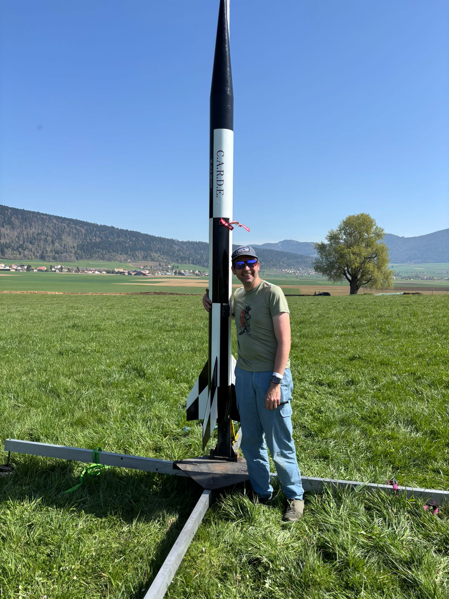
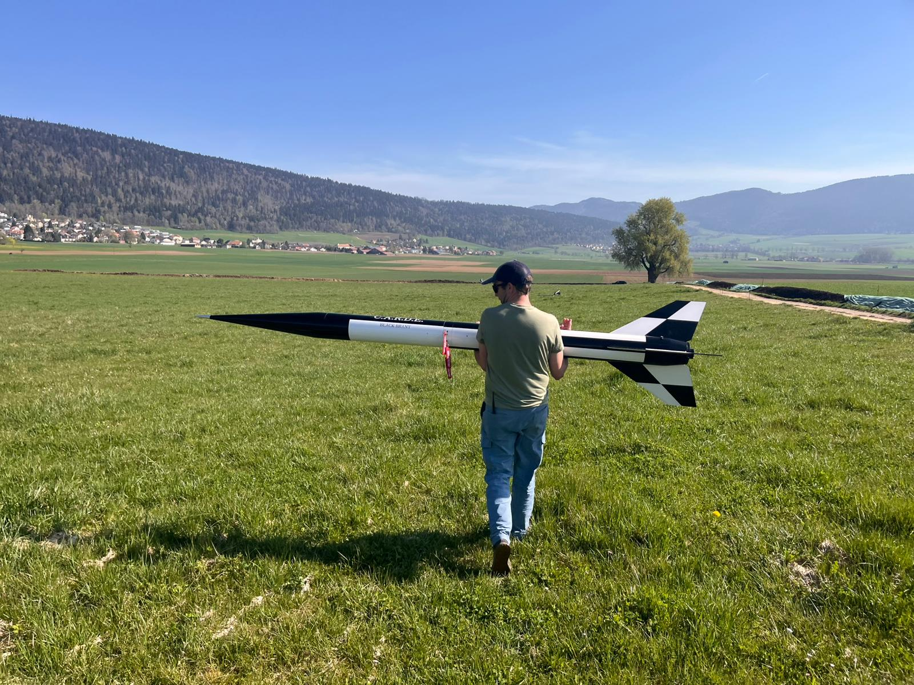
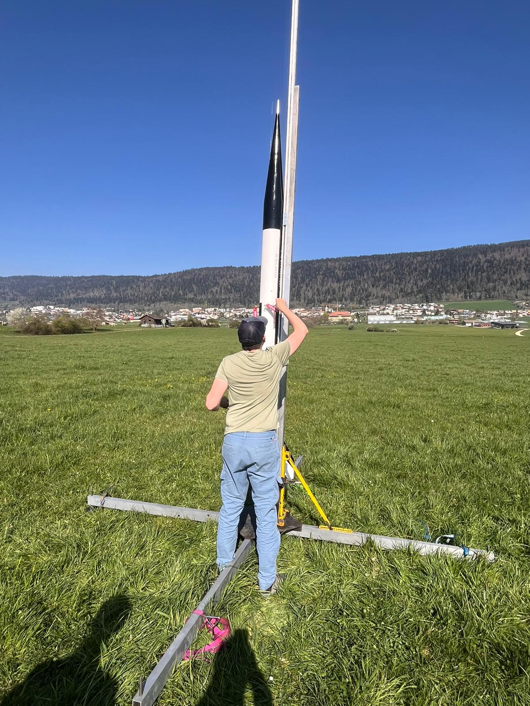
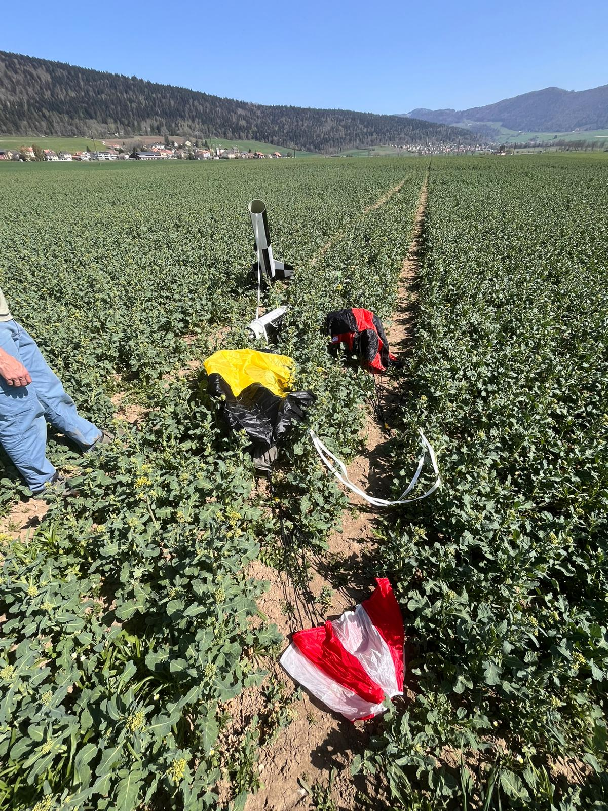
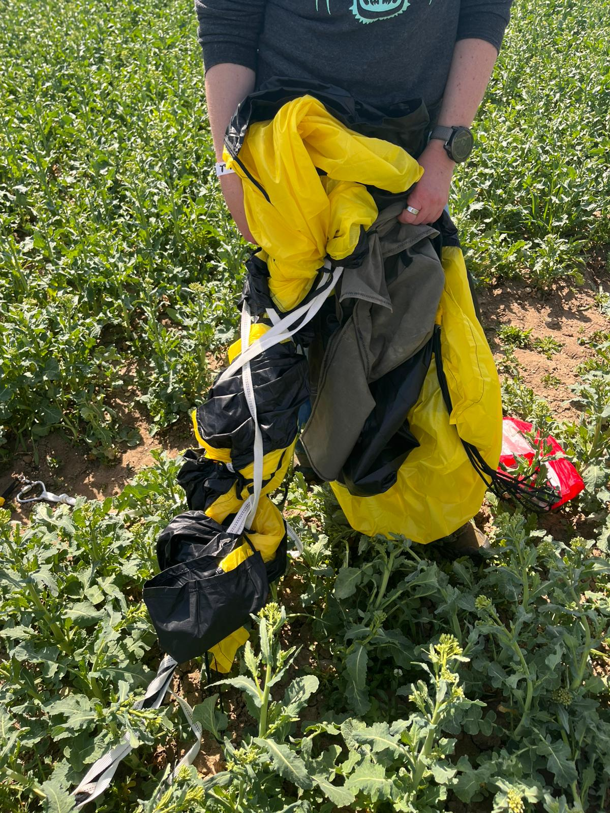
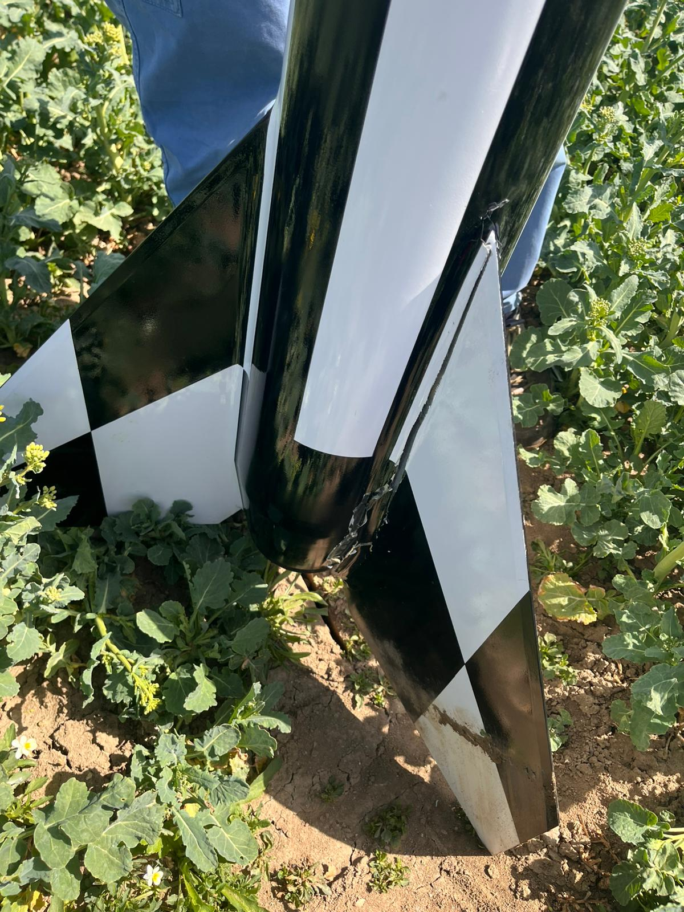

\newpage

# Flight Summary

The L3 certification flight of the Black Brant 6" scale model took place on 11 April 2026. The flight was not successful for certification purposes. The rocket sustained damage on landing due to a failure of the main parachute to fully inflate, resulting in a higher-than-nominal descent rate during the main phase and the separation of a single fin on ground impact.

The root cause of the main parachute failure was identified through analysis of onboard video footage. What initially appeared to be a secondary issue — fin flutter at motor burnout — was subsequently identified as likely camera mount instability rather than genuine aeroelastic motion, and is discussed in Section 4.

Ground-level photographs and video from the flight are included throughout this report. Photographs and video credited to Nikolas Rohr are used with his kind permission and are marked in their captions.

{ width=60% }

{ width=70% }

{ width=55% }

# Timeline of Events

| Event | Status |
|:------|:-------|
| Launch and motor burn | Nominal |
| Motor burnout / max Q | Nominal — apparent fin distortion in footage later attributed to camera mount instability (see Section 4) |
| Apogee detection and drogue deployment | Nominal |
| Drogue descent | Anomalous — descent rate significantly below target (see Section 3) |
| Main deployment altitude | Nominal — separation and main deployment triggered correctly |
| Main parachute inflation | **Failed** — parachute tangled by wrapped shock cord |
| Landing | Hard landing; single fin separated from airframe |

# Primary Failure: Main Parachute Tangling

## Observation

Onboard video footage captured the entire descent sequence and proved invaluable in diagnosing the failure. The footage clearly shows the following sequence of events:

1. At apogee, the drogue parachute deployed and inflated correctly.
2. During the drogue descent phase, the rocket entered a sustained, rapid spin beneath the drogue canopy.
3. At main deployment altitude, the electronics bay separation occurred correctly and the main deployment bag was ejected.
4. As the main parachute began to inflate, the drogue-side shock cord — which had been rotating with the spinning rocket — wrapped around the main canopy.
5. The wrapped shock cord constricted the main parachute, preventing it from fully inflating.
6. The rocket descended under a partially-inflated, tangled main parachute at a significantly higher rate than the design descent rate of 4.32 m/s (14.2 ft/s).

[View onboard video — drogue descent spin and landing](https://chrispedder.github.io/L3-project/slides/videos/l3_drogue_spin_and_landing.mp4)

Ground-level footage of the same flight — both the vertical ascent clip and the longer walk-out to the recovery site — was kindly provided by Nikolas Rohr and is listed in the appendix video references.

[View ground-level launch ascent (photo/video: Nikolas Rohr)](https://chrispedder.github.io/L3-project/slides/videos/rohr_launch_ascent.mp4)

{ width=70% }

{ width=60% }

## Root Cause: Oversized Drogue → Flat Descent Attitude → Windmilling Fins

The onboard flight computer recorded a drogue descent rate of approximately **58 ft/s (17.7 m/s)**. The design target for the drogue descent rate was **75–85 ft/s**, based on the need for a fast enough descent to avoid excessive drift while keeping loads within structural limits.

However, the actual descent rate of 58 ft/s was well *below* the target range. This means the 36" drogue canopy was providing significantly more drag than intended, which in turn kept the booster hanging in an excessively flat attitude relative to the airflow rather than the intended inverted-V.

For reference, the pre-flight calculated drogue descent rate was 47.2 ft/s (14.4 m/s) based on the standard drag equation:

$$v = \sqrt{\frac{2mg}{\rho \, C_D \, A}}$$

The measured 58 ft/s (17.7 m/s) is higher than the calculated 47.2 ft/s, likely due to the high altitude (lower air density) and the real-world performance of the canopy differing slightly from the assumed $C_D = 2.2$. Nevertheless, the descent was still slow enough, and the hang-attitude flat enough, for the spin mechanism described below to develop.

Reviewing the onboard footage frame by frame confirms that the rocket is essentially spin-free for the powered and coast phases, and that rotation only begins to build *well into* the drogue descent. This rules out any carry-through of roll from the boost phase (including from the apparent fin motion near max Q, which is discussed in Section 4 and is in any case a camera-mount artefact). The spin must therefore originate from aerodynamic forces acting on the descending airframe itself.

With the 36" drogue holding the booster at a flatter-than-intended attitude, the large swept fins are exposed side-on to the airflow and behave as **windmill blades**. Any small asymmetry — turbulence, a slight off-axis swing of the booster, minor fin-to-fin geometric differences — produces a small rotational torque, and the swept fin planform then sustains and accelerates that rotation as lift builds across the now-rotating fins. Over the 111 s of drogue descent, this mechanism has ample time to wind the booster up into the sustained spin seen in the footage.

The story is therefore: **oversized drogue → flat descent attitude → fins catch cross-flow and act as windmill blades → spin builds over 111 s → drogue-side shock cord accumulates wraps → main deploys into the wrapped cord and cannot inflate.** A correctly-sized drogue that establishes a clean inverted-V would keep the fins trailing vertically in the wake of the airframe, where they see minimal cross-flow and cannot act as windmill blades.

## Contributing Factor: Harness Attachment Geometry

The shock cord separation point was positioned at approximately one-third / two-thirds of the total harness length from the electronics bay. This geometry placed the drogue-side shock cord closer to the electronics bay, leaving a longer run of cord on the main side. The longer main-side cord provided more material to wrap around the main canopy during the spin.

# Secondary Observation: Apparent Fin Distortion at Max Q — Camera Mount Artefact

## Initial Observation

On first review of the onboard footage, small but visible distortion of the fins was observed at or very near motor burnout, corresponding to the point of maximum dynamic pressure (max Q) during the flight. This was initially interpreted as minor fin flutter.

[View onboard video — launch to apogee](https://chrispedder.github.io/L3-project/slides/videos/l3_launch_to_apogee.mp4)

## Revised Interpretation — Likely Camera Mount Instability

Following review with my TAP (Andreas), the distortion was re-examined frame-by-frame. In each frame where the fins appear distorted, fixed ground features (in particular the roads visible in the background) are distorted in the same direction and with a similar character. A genuine aeroelastic deformation of the fins would not produce a correlated geometric distortion of the distant, rigid background, whereas an unstable or vibrating camera mount — through rolling-shutter skew and lens motion — would affect fins and background together in exactly this way.

{ width=90% }

The most likely explanation for the observed distortion is therefore **camera mount instability** rather than fin flutter. This is consistent with:

1. The absence of any post-flight evidence of flutter-induced damage to the fins (the single fin separation is fully accounted for by the hard landing impact).
2. The pre-flight fin flutter analysis in the L3 Design Document (Section 9.3), which calculated a flutter boundary velocity of **284 m/s (Mach 0.85)** against a maximum flight velocity of **215 m/s (Mach 0.64)** — a safety factor of **1.32**. The flight stayed comfortably below the flutter boundary.
3. The rolling-shutter behaviour typical of small action cameras when rigidly coupled to a vibrating airframe.

Accordingly, no fin-flutter remediation is required on the basis of flight observations. The camera mount, however, should be reviewed for increased rigidity and/or vibration isolation before future flights so that onboard footage can be relied upon as a diagnostic tool.

# Damage Assessment

The hard landing under the partially-inflated main parachute resulted in the following damage:

| Component | Damage | Severity |
|:----------|:-------|:---------|
| Fin (×1) | Separated from motor tube at bonding joint | Major — requires re-bonding |
| Fin fillets (×1) | Destroyed on separated fin | Major — requires re-creation |
| Remaining fins (×2) | No visible damage | None |
| Body tube | No visible damage | None |
| Nose cone | No visible damage | None |
| Electronics bay | No visible damage; all electronics functional | None |
| Parachutes | No visible damage after untangling | None |

{ width=55% }

# Proposed Remediations

## 6.1 — Drogue Parachute: Reduce Size and Modify Harness Geometry

**Problem:** The 36" Fruity Chutes Iris Ultra drogue produced too much effective drag, holding the booster in a flat descent attitude (58 ft/s vs. 75–85 ft/s target) in which the swept fins could act as windmill blades and develop a sustained spin.

**Remediation 1 — Switch to a 30" Fruity Chutes Classic Elliptical drogue:**

Replace the 36" Iris Ultra drogue ($C_D = 2.2$) with a **30" Fruity Chutes Classic Elliptical** ($C_D = 1.5$, canopy area $A = \pi (0.381)^2 = 0.456$ m²). The expected descent rate is:

$$v = \sqrt{\frac{2 \times 17.25 \times 9.81}{1.131 \times 1.5 \times 0.456}} \approx 21 \text{ m/s (69 ft/s)}$$

OpenRocket simulates this at roughly 72–75 ft/s, and Fruity Chutes note that real-world rates typically come in slightly lower than simulated because the simulator does not account for the airframe's own drag — so a practical descent rate in the high-60s ft/s is expected, which sits at the low end of the 75–85 ft/s target.

The effective drag area ($C_D \cdot A$) comparison is the clearer story:

| Canopy | $C_D$ | Area (m²) | $C_D \cdot A$ (m²) |
|:-------|:-----:|:---------:|:------------------:|
| 36" Iris Ultra (as flown) | 2.2 | 0.657 | 1.45 |
| **30" Classic Elliptical (chosen)** | **1.5** | **0.456** | **0.68** |
| 24" Classic Elliptical (considered) | 1.5 | 0.292 | 0.44 |

The 30" Classic roughly halves the effective drag area relative to the 36" Iris Ultra, which should be more than enough to change the descent attitude from flat to a clean inverted-V and eliminate the windmilling mechanism. A 24" Classic was considered but would give a simulated descent rate of ~94 ft/s (real-world ~80–85 ft/s), which sits at the aggressive end of the range and — as shown below — drives the main opening shock up substantially. The 30" Classic was therefore selected as the best balance of attitude correction without an excessive increase in main deployment load.

**Remediation 2 — Move harness attachment point:**

Relocate the shock cord separation point from the current one-third / two-thirds split to approximately **one-quarter / three-quarters**, moving the attachment closer to the electronics bay. This achieves two things:

1. Shortens the drogue-side shock cord run, reducing the amount of cord available to wrap around the main.
2. Positions the main parachute further from the drogue attachment, giving it more clearance during inflation.

## 6.2 — Main Opening Shock at the Higher Deployment Velocity

A faster drogue descent increases the velocity at which the main parachute deploys, and the peak opening force scales approximately with the square of the deployment velocity. This warrants explicit reassessment against the structural margins set out in the L3 Design Document.

The original design calculation used a main deployment velocity of **16 m/s** (matching the slow drogue descent that was assumed for the design), producing a calculated peak main opening force of **1880 N**. At the new expected drogue descent rate of ~21 m/s (30" Classic), the opening force scales as:

$$F_{\text{new}} \approx 1880 \text{ N} \times \left(\frac{21}{16}\right)^2 \approx 3240 \text{ N}$$

For comparison, had a 24" Classic been chosen (~26 m/s descent), the scaled force would have been approximately:

$$F_{24"} \approx 1880 \text{ N} \times \left(\frac{26}{16}\right)^2 \approx 4960 \text{ N}$$

i.e. the 30" Classic raises the opening shock by a factor of ~1.7 relative to the original design case, whereas the 24" Classic would have raised it by a factor of ~2.6. Both figures remain within the load ratings of the hardware (forged eyebolts, u-bolts, 1" tubular Kevlar shock cord, bulkhead epoxy joints — all rated in the tens of kN), but the 30" Classic clearly preserves a much larger margin.

**Where the increased shock matters most on this airframe:**

1. **Shock cord and swivel at the main attachment.** The main-side shock cord run is long and runs through an inline swivel; this is the element that actually sees the peak tensile load on opening. At 3.2 kN the margin over the Kevlar rated strength is still large, but repeated cycles at higher loads accelerate abrasion and fibre fatigue; the shock cord and swivel should therefore be inspected carefully before and after each flight.
2. **Bulkhead eyebolts and their epoxy bonds.** The forged eyebolts themselves are far over-rated, but the epoxy interface bonding them into the bulkheads is the weaker link. A step-up from ~1.9 kN to ~3.2 kN is well within ratings, but it is the kind of load increase that will expose any pre-existing voids or weak bond lines — a post-repair inspection of the bulkhead bonds is prudent.
3. **Deployment bag and its cord.** The bag itself sees the peak load as the lines pay out; the bag's bridle, line-stow elastics and bag attachment stitching are the elements most likely to show wear.
4. **Coupler / payload-bay joint.** The opening shock acts along the airframe axis; the coupler-to-tube friction fit and the screws that retain it transmit this load, and should be checked for elongated holes or loosening after the first flight under the new drogue.

**Mitigation already in place — deployment bag for the 120" main:**

The 120" main parachute is packed into and deployed from a **deployment bag**. This is material to the opening-shock picture and should not be overlooked. Unlike a free-packed canopy, which begins to inflate as soon as it leaves the airframe, a bag-deployed canopy remains closed until full line stretch is reached; only then does the bag strip off and allow the canopy to open. This has two important effects:

1. It **delays inflation** until the rocket has decelerated along the shock cord, spreading the deceleration event over a longer time.
2. It **controls the rate of inflation** (via the line-stow elastics and the orderly strip-off of the bag), preventing the near-instantaneous full-canopy inflation that produces the worst peak loads on a free-packed chute.

For this reason, the simple $v^2$ scaling above should be read as an **upper-bound estimate** — the deployment bag will meaningfully reduce the peak load actually transmitted into the airframe compared to a bag-less deployment at the same velocity. This is the main reason the 30" Classic is comfortable from a loads standpoint: the combination of a moderately higher deployment velocity with a bag-controlled main inflation keeps the realised opening shock well inside the structural margins of the recovery hardware.

## 6.3 — CO~2~ Ejection Systems

**Problem:** The black powder ejection charges required for this airframe (3.8–5.7 g primary, 5.0–7.4 g backup) are large enough to cause significant heat damage to the Nomex blankets protecting the recovery harnesses and parachutes. Over repeated flights and ground tests, this degradation will compromise the thermal protection and risk damage to the recovery system itself.

**Remediation — Replace primary ejection with CO~2~ systems:**

The primary ejection method on both the drogue and main sides will be converted from black powder to CO~2~ cartridge-based systems, such as the Tinder Rocketry Raptor or Eagle. These systems use a sealed CO~2~ cartridge punctured by an electronically-fired mechanism to pressurise the compartment, providing clean, cool gas ejection with no combustion products.

Advantages of CO~2~ ejection for this airframe:

1. **No thermal damage.** Eliminates the heat source that destroys the Nomex blankets, extending their service life indefinitely.
2. **Cleaner recovery bay.** No black powder residue on bulkheads, wiring, or recovery hardware.
3. **More consistent pressurisation.** CO~2~ cartridges provide a repeatable, known gas volume, reducing the need for iterative ground-test tuning of charge mass.
4. **Simpler field preparation.** No loose black powder to measure and pack at the launch site.

The existing black powder charges will be retained as backup charges on the redundant altimeter, ensuring that dual-redundant deployment capability is maintained. This provides the best of both approaches: clean primary ejection with a proven pyrotechnic fallback.

## 6.4 — Fin Repair

**Problem:** One fin separated from the motor tube on landing impact.

**Remediation:**

1. **Re-bonding:** The separated fin will be re-bonded to the motor tube using **Proline 4500** epoxy, matching the original construction method.
2. **Fillet reconstruction:** Internal and external fillets will be re-created at the fin root joint, matching the original fillet dimensions and construction (Proline 4500 with Kevlar reinforcement internally, West Systems with silica externally).
3. **Refinishing:** The repaired fin will be repainted to match the other two fins.

No airfoil modification or composite overlay is planned: in light of the revised interpretation of the max-Q footage (see Section 4), the original G10 fin construction is considered adequate as-flown and will be restored to its pre-flight condition.

# Modifications and Repairs Undertaken

This section documents work carried out on the airframe and recovery system in response to the failure analysis above. It will be extended as remediation progresses.

## 7.1 — Ejection Charge Well Geometry Testing

**Motivation:** The black powder backup charges required for this airframe (up to 7.4 g on the main side) produce a substantial fireball on ignition. The existing 3D-printed charge well, while functional, directs a relatively concentrated jet of hot combustion products onto the Nomex blanket protecting the recovery harness and parachute. Over repeated use, this risks cumulative heat damage to the Nomex. The aim of this test was to see whether the charge well geometry could be modified to contain more of the fireball within the well itself, reducing the thermal load on the blanket downstream.

**Method:** Two 3D-printed charge well geometries were tested, each loaded with the full 7.4 g main-side backup charge of black powder and fired on the bench (not in the airframe):

1. **"Long and thin" — original geometry.** The narrow, tall well used successfully on previous flights.
2. **"Short and fat" — revised geometry.** A shorter, wider well with the same internal volume but a larger diameter and reduced height.

Each test was filmed for comparison of the fireball shape, extent, and duration.

**Results:**

| Geometry | Charge | Video |
|:---------|:-------|:------|
| Long and thin (original) | 7.4 g BP | [View test video](https://chrispedder.github.io/L3-project/slides/videos/7.4g_narrow_ejection.mp4) |
| Short and fat (revised) | 7.4 g BP | [View test video](https://chrispedder.github.io/L3-project/slides/videos/7.4g_wide_ejection.mp4) |

On visual comparison of the two videos, the fireball appears noticeably **more contained in the short-and-fat geometry**: the hot jet exits more vertically and over a shorter distance before dissipating, whereas the long-and-thin geometry produces a more extended, directed plume. This suggests the short-and-fat geometry should impose a lower peak thermal load on the Nomex blanket, and should therefore be less damaging over repeated use.

**Status and next step:** Bench testing is promising but is not fully representative of the confined, pressurised environment inside the airframe. The next test must be an in-airframe ground ejection test with the Nomex blanket and recovery harness in place, using the short-and-fat well, to confirm that the improved fireball containment translates into measurably less blanket scorching than the original geometry under realistic conditions.

# Summary of Actions

| # | Action | Component | Status |
|:--|:-------|:----------|:-------|
| 1 | Replace 36" Iris Ultra drogue with 30" Fruity Chutes Classic Elliptical | Recovery | Planned |
| 2 | Move harness attachment to 1/4–3/4 split | Recovery | Planned |
| 3 | Inspect main-side shock cord, swivel and deployment bag for wear after first flight under new drogue | Recovery | Planned |
| 4 | Install CO~2~ ejection as primary on both sides | Ejection | Planned |
| 5 | Retain black powder as backup charges only | Ejection | Planned |
| 6 | Re-bond separated fin with Proline 4500 | Booster | Planned |
| 7 | Reconstruct fin root fillets | Booster | Planned |
| 8 | Repaint repaired fin to match | Booster | Planned |
| 9 | Bench-test "short and fat" BP charge well (7.4 g) | Ejection | Complete (see §7.1) |
| 10 | In-airframe ground ejection test with short-and-fat well and Nomex blanket | Ejection | Planned |

\newpage

# Appendix: Onboard Video References

The following onboard video clips are referenced in this report:

| Reference | Description | Link |
|:----------|:------------|:-----|
| Video 1 | Launch to apogee — apparent fin distortion at motor burnout (see Section 4) | [View](https://chrispedder.github.io/L3-project/slides/videos/l3_launch_to_apogee.mp4) |
| Video 2 | Drogue descent spin and landing — shows sustained rotation and main parachute tangling | [View](https://chrispedder.github.io/L3-project/slides/videos/l3_drogue_spin_and_landing.mp4) |
| Video 3 | Ground-level video of the flight | [View](https://chrispedder.github.io/L3-project/document/images/ground_video.mp4) |
| Video 4 | Ground-level launch ascent (photo/video: Nikolas Rohr) | [View](https://chrispedder.github.io/L3-project/slides/videos/rohr_launch_ascent.mp4) |
| Video 5 | Walk-out to recovery site (photo/video: Nikolas Rohr) | [View](https://chrispedder.github.io/L3-project/slides/videos/rohr_ground_launch.mp4) |
| Video 6 | Ejection charge well test — 7.4 g BP, "long and thin" (original) geometry | [View](https://chrispedder.github.io/L3-project/slides/videos/7.4g_narrow_ejection.mp4) |
| Video 7 | Ejection charge well test — 7.4 g BP, "short and fat" (revised) geometry | [View](https://chrispedder.github.io/L3-project/slides/videos/7.4g_wide_ejection.mp4) |
